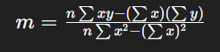
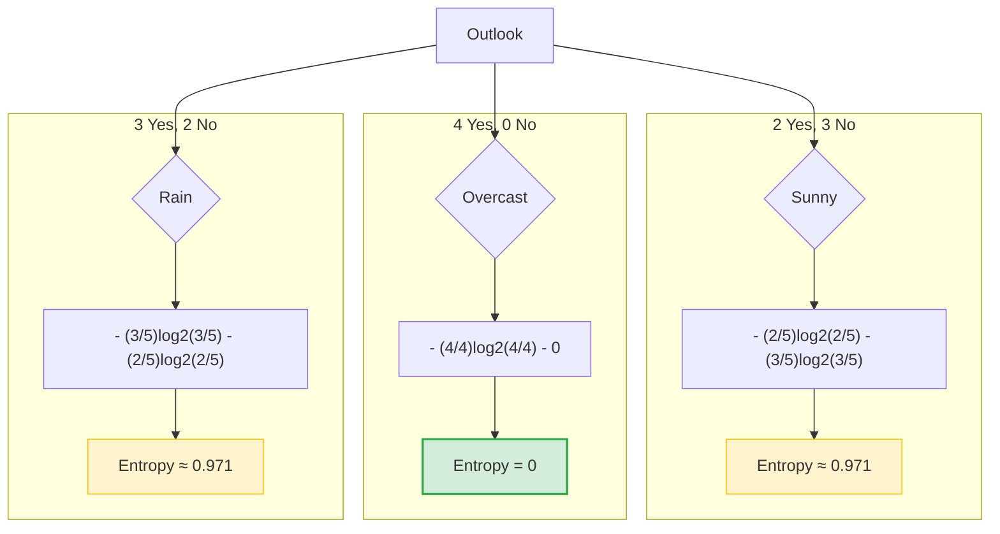
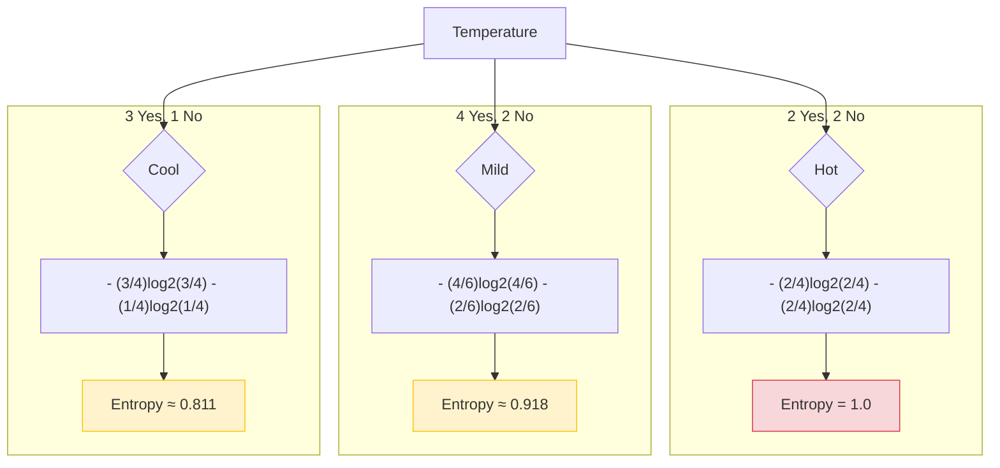
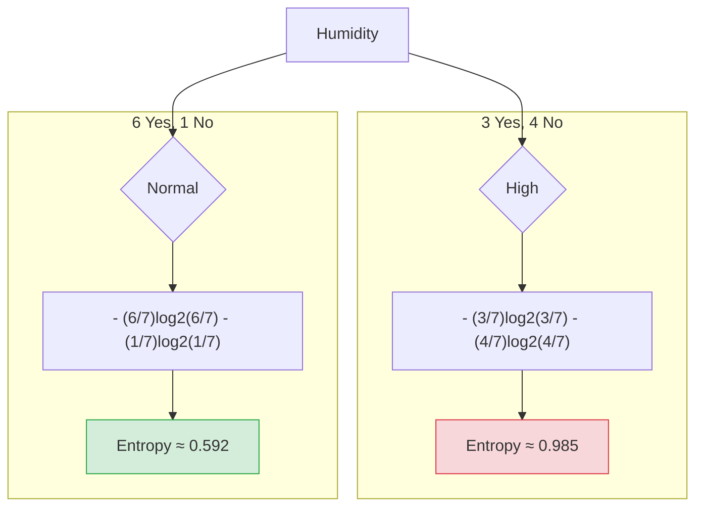
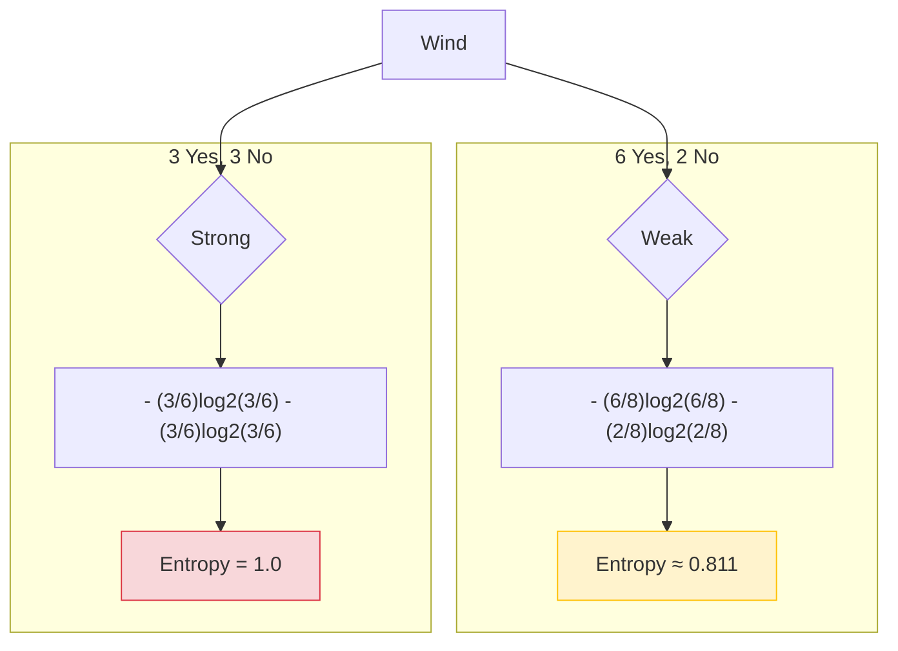
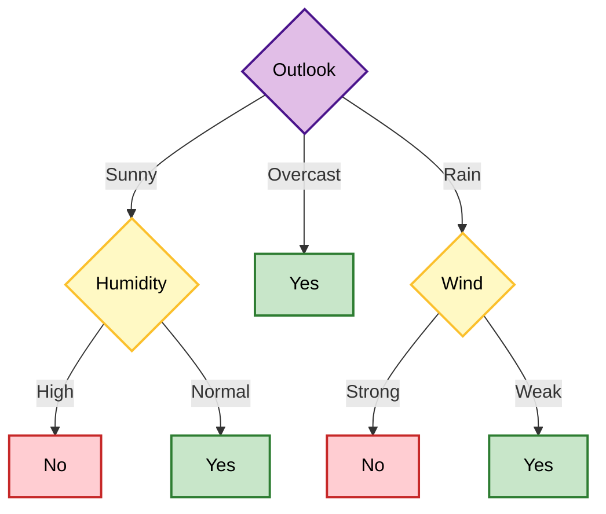
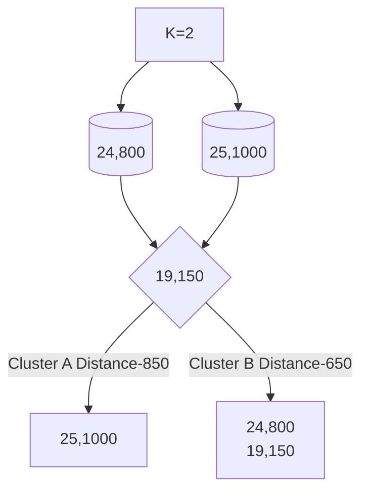

# Data Analytics

# 1. Primary Data

**Primary data** is the data that is **collected directly by the researcher for the first time**.

It is **original and specific to the study**.

### Examples

- Surveys
- Interviews
- Experiments
- Questionnaires
- Observations

# 2. Secondary Data

**Secondary data** is data that has **already been collected by someone else** and is reused for another analysis.

### Sources of Secondary Data

- Government reports
- Research papers
- Books
- Websites
- Census data
- Company reports

### Example

A student uses **government census data** to analyze population growth.

Since the data was **already collected**, it is **Secondary Data**.

---

## Handling missing data

Some values in a dataset are not stored or recorded.

Missing values are usually represented as:

- NaN (Not a Number)
- NULL
- Blank cells
- ?

**Why Does Missing Data Occur?**

1. Data entry errors
2. Sensor malfunction
3. Survey non-response
4. Data corruption
5. Optional fields left blank

**Types of Missing Data**

#### **1. MAR (Missing At Random)**

Data is missing completely at random when the missingness is **not related to any variable** (neither observed nor unobserved). There is **no pattern or underlying cause**.   

**Example:**

In a survey about **driving habits**, one demographic question asks for **income level**.

Some respondents accidentally skip this question.

The missing income data is **not related to driving habits or any other variables**.

Hence, the missing data is **MCAR**.

#### 2. **MAR (Missing At Random)**

Data is missing at random when the missingness is **related to observed variables**, but **not related to the missing value itself**.

The missing data **depends on other observed variables**, but **not on the missing value itself**.

**Example:**

Suppose a survey asks **salary and age**.

Some people **do not report salary**, but this happens more often for **older people**.

So missing salary depends on **age (which we know)**.

This is **MAR**.

#### 3. MNAR — Missing Not At Random

The missing data **depends on the missing value itself**.

**Example:**

People with **very high salaries** refuse to report their salary.

So salary is missing **because of the salary value itself**.

This is **MNAR**.

---

## 1. Column Deletion

Use when more then 50% values are missing

```jsx
df.drop(columns=[’age’])
```

## 2. Row Deletion

```jsx
df.dropna()
```

---

### Imputation Methods(Replacing missing values)

#### Mean method( for numerical value)

Replacing missing values with estimated values.

Best for normally distributed data.

```jsx
df['Marks'].fillna(df['Marks'].mean(),inplace=True)
```

#### Mode method

```jsx
df['Marks'].fillna(df['Marks'].mode()[0],inplace=True)
```

#### Median method(for categorical data)

Replace with previous value

Example- Temperature readings over time.

```jsx
df['Marks'].fillna(df['Marks'].median(),inplace=True)
```

#### Forward fill(Time Series)

```jsx
df.fillna(method='ffill')
```

#### Backward fill

```jsx
df.fillna(method='bfill')
```

#### Interpolation

Used in time series data

Value changed gradually(temperature, sensors)

```jsx
df.interpolate()
```

---

### IsNull

returns true where values are missing

```jsx
df.isnull()
```

```jsx
df.isnull().sum()
```

---

## Outlier

Outlier is a data value that s significantly different from other values in the data set.

## Methods to detect the outliers

IQR=Q3-Q1

#### 1. IQR Method(Interquartile Range)

Q1- 25th quartile

Q3- 75th quartile

**Outlier Boundaries-**

Lower Bound=Q1−1.5×IQR

Upper Bound=+1.5×IQR

```jsx
IQR = Q3 − Q1 
```

**Example:**

Data: 10, 12, 14, 15, 18, 20, 100

- Q1 = 12
- Q3 = 20
- IQR = 8

Lower Bound = 12 − 1.5×8 = 0

Upper Bound = 20 + 1.5×8 = 32

**100 is an outlier**

#### 2. Z-Score Method

Measures how far a value is from mean in terms of standard deviation.

```go
Z=(X-Mean)/SD
If |Z|>3->Outlier
```

# IQR vs Z-Score

| Method | Best For |
| --- | --- |
| IQR | Skewed data |
| Z-Score | Normally distributed data |



---

## Noise in Data

### What is Noise?

Noise refers to small random errors or unwanted value.

Noise means unwanted random variation in data.

**Smoothing** helps remove noise and reveal the real trend.

## Methods to Handle Noise

#### 1. Smoothing

- Exponential moving average
- Simple moving average 
 Each value is replaced by the **average of nearby values**.
    
    Data: 10, 12, 14, 16, 18
    
    Window size = 3
    
    - (10 + 12 + 14) / 3 = 12
    - (12 + 14 + 16) / 3 = 14
    - (14 + 16 + 18) / 3 = 16
        
        Smoothed data: **12, 14, 16**
        

```python
df['sales'].rolling(window=3).mean()
```

```jsx
Yt=1/k∑(t to t-k+1) Yi
```

#### 2. Binning

Divides data into groups and replaces with existing values

Replace all values in a bin with the **average (mean)** of that bin.

Bin 1 → 2, 4, 6

Boundaries = 2 and 6

- 2 → 2
- 4 → nearest boundary = 2
- 6 → 6

Bin 2 → 8, 10, 12

Boundaries = 8 and 12

- 8 → 8
- 10 → nearest boundary = 8
- 12 → 12
    
    Smoothed data:
    

**2, 2, 6, 8, 8, 12**

#### 3. Linear Regression (Best way to reduce noise and identify outliers)

It models the relationship between variables by fitting the **best possible straight line** through the data. It is widely used for **prediction, trend analysis, and noise reduction**.

Formula:

```jsx
y=mx+c
where
y = dependent variable (target/output)
x = independent variable (input/feature)
m = slope (how much y changes when x increases)
c = intercept (value of y when x = 0)
```


**Example:**

Age X= 43,21,25,42,57,59,55

Glucose Level Y= 99,65,79,75,87,81,?

```hcl
#predict the value in glucose column and also predict slope and intercept
# Age X= 43,21,25,42,57,59,55
# Glucose Level Y= 99,65,79,75,87,81,?

data={
    "Age":[43,21,25,42,57,59],
    "Glucose":[99,65,79,75,87,81]
}
import pandas as pd
df=pd.DataFrame(data)
y=df[["Age"]]
x=df[["Glucose"]]

from sklearn.linear_model import LinearRegression
lr=LinearRegression()
lr.fit(y,x)

y_pred=lr.predict(pd.DataFrame({"Age":[55]}))
print(y_pred)

print("m(slope)",lr.coef_)
print("c(intercept)",lr.intercept_)

#output
#print("m(slope)",lr.coef_)
#print("c(intercept)",lr.intercept_)
```

---

### Skewness

Checks if data is asymmetrical 

---

### Model Transformation

#### 1.  Scaling

#### 2.  Log Transformation

When data is highly skewed

```jsx
X'=log(X)
```

#### 3. Normalization

set between 0 to 1

```go
X’=(X-Xmin)/(Xmax-Xmin)
```

1. Z-score normalization
    
    Transforms data so that mean=0, sd=1
    

```jsx
Z=X-mean/sd
```

---

## Unit-3

## Distribution

A **distribution** describes how values of a variable are spread or distributed.
Distributions are important because
• Help understand data pattern
• Detect outliers, Used in probability & ML
• Support decision-making

**Main Types of Distributions-**

1. Normal Distribution
• Symmetric (bell-shaped curve)
• Mean = Median = Mode
• No heavy skew
Used for: Heights, marks (when evenly spread)
2. Uniform Distribution
• All values have equal probability
Example: Fair dice roll
3. Binomial Distribution
• Discrete distribution
• Fixed number of trials
• Only two outcomes (Success/Failure)
Example: Number of heads in 5 coin tosses
4. Poisson Distribution
• Counts number of events in fixed time/area
Example: Number of customers per hour
5. Exponential Distribution
• Models waiting time
• Right-skewed
Example: Time until next bus arrives
6. Log-Normal Distribution
• Right-skewed
• Values cannot be negative
Example: Income, stock prices
7. Gamma Distribution
• Continuous, right-skewed
• Used for positive data

---

**1. Right Skewed Distribution**

- Tail is on the right side
- Few large values pull the mean upward
- **Mean > Median**

**2. Left Skewed Distribution**

- Tail is on the left side
- Few small values pull the mean downward
- **Mean < Median**

## Mean, standard deviation, median, and mode

P**roblem: when a data is not properly distributed**
ie. Values are not symmetric, or having extreme values (outliers) or one tail is longer
(left or right).
**➔Measures to be taken:**
**→using Mean , Median**
Median is more reliable because Mean is affected by extreme values (outliers).
Median is the middle value and is not affected much by very large or very small
values.

```python
Example: Data: 10, 12, 15, 18, 200
Mean = (10+12+15+18+200)/5 = 51
Median = 15
Here, 200 pulls the mean upward.
But median (15) better represents the typical value.
Thus, for heavily distributed data, Median is highly suitable.
Since data is heavily skewed:
- A Normal Distribution is NOT suitable (because it is symmetric).
Better choices are:
• Log-Normal Distribution (for right-skewed data like income, sales)
• Exponential Distribution (for waiting times)
• Gamma Distribution (for positive skewed data)
```

# 1. Mean (Average)- Affected by outlier

The **mean** is the **average value of a dataset**.

Formula:


Where

- x= data values
- n = number of values

Example:

Data = `2, 4, 6, 8`

Mean=2+4+6+8/4 = 5

---

# 2. Median

The **median** is the **middle value when data is arranged in order**.

Example:

Data = `3, 5, 7, 9, 11`

Median = **7**

If the number of values is **even**, take the average of the two middle values.

Example:

`2, 4, 6, 8`

Median = (4 + 6) / 2 = **5**

---

# 3. Mode

The **mode** is the **value that appears most frequently in the dataset**.

Example:

Data = `1, 2, 2, 3, 4`

Mode = **2**

A dataset can have:

- **One mode** → Unimodal
- **Two modes** → Bimodal
- **More than two modes** → Multimodal

---

# 4. Standard Deviation

**Standard deviation measures how spread out the data values are from the mean.**

- **Low standard deviation** → values are close to the mean
- **High standard deviation** → values are spread far from the mean

Formula:


Where

- x = data value
- μ = mean
- n= number of values

Example:

Data = `2, 4, 6`

Mean = 4

Standard deviation measures **how much 2 and 6 deviate from 4**

---

## Confidence Intervals(CI):

A Confidence Interval is a range of values used to estimate an unknown population
parameter (like mean or proportion) with a certain level of confidence.

```python
Example:
Instead of saying Average height = 170 cm, We say
Average height is between 168 cm and 172 cm (95% confident)
```

**Why is it needed?**

- Sample gives only estimate
• Population value is unknown
• CI tells how accurate the estimate is

### Types of Confidence Intervals:

### 1. **CI for Mean → Z-Distribution**

Used when :
• Population standard deviation (σ) is known
• Sample size is large (n ≥ 30)

Formula:


Example:

Given:

- Mean xˉ=100
- Standard deviation σ=10
- Sample size n=36
- Confidence level = **95%**
- Z=1.96
    
    Z is 1.96 at ci 95%
    
    #### Step 1: Calculate Standard Error (SE)
    


#### Step 2: Calculate Margin of Error (ME)


#### Step 3: Calculate Confidence Interval


### Final Confidence Interval-(96.73, 103.27)

→ This means **we are 95% confident that the true population mean lies between 96.73 and 103.27.**

## 2. Confidence Interval for Mean (σ Unknown) – t Distribution

### When it is used

Use **t-distribution** when:

- Population standard deviation **σ is unknown**
- **Sample size is small (n < 30)**
- We use **sample standard deviation (s)**


## 3. CI for Proportion

Used when:
• Data is percentage or probability
• Yes/No type data


**Example:**

Suppose:

- 60 out of 100 people like a product

p=60/100= 0.6

Confidence level = **95% → Z = 1.96**

n=100


---

# Hypothesis Testing

**Confidence Interval** answers:

*“What is the possible range of the true value?”*

**Hypothesis Testing** answers:

*“Is the claim true or false?”*

So logically:

- **Confidence Interval** → Find a range of possible values
- **Hypothesis Testing** → Make a decision about a claim
- **Regression** → Study relationships between variables and predict values

# What is a Hypothesis?

A **hypothesis** is:

- A **claim**
- A **statement**
- Something someone believes to be **true**

Example:

A teacher says:

**“The average marks of the class is 75.”**

This is a **claim**.

# Two Important Hypothesis

When we test a claim, we create two statements.

### 1. Null Hypothesis (H₀)

This assumes the **claim is true**.

Example:

H0: μ=75

Meaning:

Average marks of the class **are 75**.

### 2. Alternative Hypothesis (H₁ or Ha)

This assumes the **claim is false**.

Example:

H1: μ!=75

Meaning:

Average marks of the class **are not 75**.

### Simple Real Example

Teacher says:

**Average marks = 75**

We check marks of 5 students:

60, 65, 70, 72, 68

Calculate average:

Average=60+65+70+72+68/5= 67

Now compare:

Claim = **75**

Sample average = **67**

Since **67 is far from 75**, the claim is likely incorrect.

Decision:

**Reject the null hypothesis**

**Accept Alternate Hypothesis**

---

# Linear Regression

**Linear Regression** is a statistical method used to **find the relationship between two variables** and **predict future values**.

It tries to find the **best straight line** that fits the data.

It answers the question:

**If X changes, how does Y change?**

**Example-**

Suppose:

- **X = Hours studied**
- **Y = Marks scored**

We want to predict:

If a student studies **6 hours**, what marks might they get?

This prediction is done using **regression**.

# Types of Regression

### 1. Simple Linear Regression

- Only **one independent variable (X)**

Example:

Marks depend only on **study hours**.

### 2. Multiple Regression

- **More than one independent variable**

Example:

Marks depend on:

- Study hours
- Attendance
- Sleep

Formula:


---

## Random Variable

A **Random Variable** is a variable that **assigns a numerical value to the outcome of a random experiment**.

In simple words:

A random variable **converts random outcomes into numbers**.

# What is a Random Experiment?

A **random experiment** is an experiment where the outcome **cannot be predicted with certainty**.

Examples:

- Tossing a coin
- Rolling a dice
- Selecting a card from a deck

# Example 1: Coin Toss

**Experiment:** Toss a coin once

### Sample Space

S={Head,Tail}

Now define a random variable **X**.

- X=1 if the result is **Head**
- X=0 if the result is **Tail**

| Outcome | X (Random Variable) |
| --- | --- |
| Head | 1 |
| Tail | 0 |

Here **X is a random variable** because it assigns numbers to outcomes.

# Types of Random Variables

There are **two main types**.

### 1. Discrete Random Variable

Takes **countable values**.

Examples:

- Dice numbers (1,2,3,4,5,6)
- Number of students in a class
- Number of heads in coin toss

### 2. Continuous Random Variable

Takes **any value in a range**.

Examples:

- Height of a person
- Temperature
- Time taken to complete a task

Example:

Height can be **160.2 cm, 160.25 cm, 160.256 cm**, etc.

---

## Probability Distribution

A Random Variable gives possible numbers.
A Probability Distribution tells how often each number can happen.
It is simply a table of values + their chances.

**Example:**

Number (X) Probability P(X)
1                    1/6
2                   1/6
3                   1/6
4                   1/6
5                   1/6
6                   1/6
This table is the probability distribution.

Real-Life Example
Suppose in a class test:
• 2 students score 90
• 3 students score 80
• 5 students score 70
Total students = 10

Now probability distribution of marks:
Marks (X) Probability
90              2/10 = 0.2
80              3/10 = 0.3
70              5/10 = 0.5


**Sum of probabilities must be 1**

---

## Bayes Theorem

**Bayes  Theorem** is used to find the **probability of an event after new information is known**.

Probability of A given B happened


**Example-**

Suppose:

- 50 students play **Cricket** → Event **B**
- 20 students play **Cricket and Football** → Event **A ∩ B**

Question:

If a student **plays cricket**, what is the probability they **also play football**?


So,

**40% of cricket players also play football.**

### 1st method


### **2nd Method**


---

## How does ML work?

Accessing vast amount of data(both structured and unstructured) and learns from it to predict the future.

It learns the data by using multiple algorithm and techniques.

## Types of ML-

1. **Supervised-** Labelled data is known. It predicts the next value.
- Classification-
    
    When output variable is category.
    
    **Types-**
    
    Random Forest
    
    Decision Tree
    
    Naive Bayes
    
    SVM
    
    KNN
    
- Regression-
    
    When output variable is a real value. Like dollar, weight.
    
    **Techniques-**
    
    Simple Linear Regression
    
    Multi Linear Regression
    
1. **Unsupervised**-Group/categories the unsorted data according to the similarities.
    
    Classification-
    
    Clustering
    
    K-Means clustering Algo
    
    Mean-Shift Algo
    
    DBSCAN Algo
    
    Principal component Analysis
    
    Association Rule mining-
    
2. **Reinforcement(Feedback based learning)**- Learns from its mistakes and receives awards.

---

## Decision tree

A decision tree is a supervised learning algorithm used for both classification and regression tasks. It has a hierarchical tree structure which consists of a root node, branches, internal nodes and leaf nodes. It works like a flowchart that helps in making step-by-step decisions, where:

- Internal nodes represent attribute tests
- Branches represent attribute values
- Leaf nodes represent final decisions or predictions.

### How does the decision tree work?

A decision tree splits the dataset based on feature values to create pure subsets ideally all items in a group belong to the same class. Each leaf node of the tree corresponds to a class label and the internal nodes are feature-based decision points. 


**1. Root Node (Income)**

**First Question**: **"Is the person’s income greater than $50,000?"**

- If Yes, proceed to the next question.
- If No, predict "No Purchase" (leaf node).

**2. Internal Node (Age)**:

**If the person’s income is greater than $50,000**, ask: **"Is the person’s age above 30?"**

- If Yes, proceed to the next question.
- If No, predict "No Purchase" (leaf node).

**3. Internal Node (Previous Purchases)**:

- If the person is above 30 and has made previous purchases, predict "Purchase" (leaf node).
- If the person is above 30 and has not made previous purchases, predict "No Purchase" (leaf node).


#### 1. Calculate the parent Entropy


---

                                                    **H(S)≈ 0.94**

#### 2. Calculate Information Gain for Each Feature

## 1. Outlook

### 1. Entropy of Each Component



### 2. Weighted Entropy (Children)


H(Outlook)≈0.694

### 3. Information Gain

**IG(Outlook)=H(S)-H(Outlook)**

IG=0.94−0.694=0.246

**IG(Outlook) ≈ 0.246**

---

## 2. Temperature

### 1. Entropy of Each Component



### 2. Weighted Entropy


                                    H(Temp)≈ **0.911**

### 3. Information Gain


---

## 2. Humidity

### 1. Entropy of Each Component



### 2. Weighted Entropy


                                          H(Humidity)≈ **0.789**

### 3. Information Gain


---

## 4. Wind

### 1. Entropy of Each Component



---

### 2. Weighted Entropy


                                                       H(Wind)≈ **0.892**

### 3.  Information Gain


---

# Final Summary

| Feature | IG Value |
| --- | --- |
| Outlook | **0.246 (Highest)** |
| Humidity | 0.151 |
| Wind | 0.048 |
| Temperature | 0.029 |



---

## Naive Bayes

Naive Bayes is **a supervised machine learning algorithm based on Bayes' Theorem, designed for classification tasks by calculating probabilities**. It assumes independence between features, meaning every feature contributes equally to the outcome. It is fast, efficient for large datasets, and commonly used for spam filtering and sentiment analysis.

#### 1. Dependent and Independent events

P(A∩B)=P(A)⋅P(B)

#### 2. Dependent Events

P(A∩B)=P(A)⋅P(B∣A)

#### 3. Conditional probability

P(B∣A) = P(A∩B)/P(A)

#### 4. Bayes Theorem

P(B∣A)=P(A∣B)⋅P(B)/P(A)

#### 5. Naive Bayes Theorem

**P(y/x1x2x3)=P(y)*P(((x1,x2,x3)/y))/P(x1x2x2)**

**→ ignore denominator**

**To Remember-**

A(A and B)= P(A)*P(B/A)

A(B and A)= P(A)*P(A/B)

P(A)*P(B/A)=P(B)*P(A/B)

**P(B/A)=(P(B)*P(A/B))/P(A)**


| Outlook | Yes | No | P(E/y) | P(E/n) |
| --- | --- | --- | --- | --- |
| Sunny | 2 | 3 | 2/9 | 3/5 |
| Overcast | 4 | 0 | 4/9 | 0/5 |
| Rain | 3 | 2 | 3/9 | 2/5 |

| Temp | Yes | No | P(E/y) | P(E/n) |
| --- | --- | --- | --- | --- |
| Hot | 2 | 2 | 2/9 | 2/5 |
| Mild | 4 | 2 | 4/9 | 2/5 |
| Cold | 3 | 1 | 3/9 | 1/5 |

| Humid | Yes | No | P(E/y) | P(E/n) |
| --- | --- | --- | --- | --- |
| High | 3 | 4 | 3/9 | 4/5 |
| Normal | 6 | 1 | 6/9 | 1/5 |

| Wind | Yes | No | P(E/y) | P(E/n) |
| --- | --- | --- | --- | --- |
| Weak | 6 | 2 | 6/9 | 2/5 |
| Strong | 3 | 3 | 3/9 | 3/5 |

### Prior Probabilities

- P(Yes)=9/14P(Yes) = 9/14P(Yes)=9/14
- P(No)=5/14P(No) = 5/14P(No)=5/14

#### **Case 1: (Sunny, Hot)**

**P(y/sunny and hot)**=P(y)*p(sunny/y)*P(hot/y)

= 9/14*2/9*2/9= 0.031

**P(n/sunny and hot)**=P(n)*p(sunny/n)*P(hot/n)

=5/14*3/5*2/5= 0.085

#### Normalize

P(y)=0.031/(0.031+0.085)=**.27**

P(n)=0.085/(0.031+0.085)=**0.73**

#### **Case 2: (Mild, Strong)**

P(y/mild and strong)=P(y)*p(mild/y)*p(strong/y)

= 9/14*4/9*3/9= 0.095

P(n/mild and string)=P(n)*p(mild/n)*p(strong/n)

=5/14*2/5*3/5= 0.086

#### Normalize

P(y)=0.095/(0.095+0.086)=**0.525**

P(n)=0.086/(0.095+0.086)=**0.475**

**Variants of Naive Bayes**

1. Bernoulli
2. Multinomial(class level)
3. Gaussian(Continuous values)

```python
import seaborn as sns
df=sns.load_dataset("iris")

x=df.drop("species",axis=1)
y=df["species"]

from sklearn.model_selection import train_test_split
x_train,x_test, y_train,y_test=train_test_split(
    x, y, test_size=0.4, random_state=42
)

from sklearn.naive_bayes import GaussianNB
gnb=GaussianNB();
gnb.fit(x_train,y_train)

from sklearn.metrics import accuracy_score,confusion_matrix
y_pred=gnb.predict(x_test)
print("Confusion Matrix:")
print(confusion_matrix(y_test, y_pred))
print("Accuracy:", accuracy_score(y_test, y_pred))

#output
#from sklearn.metrics import accuracy_score,confusion_matrix
#y_pred=gnb.predict(x_test)
#print("Confusion Matrix:")
#print(confusion_matrix(y_test, y_pred))
#print("Accuracy:", accuracy_score(y_test, y_pred))
```

---

### K-Means Clustering Algorithm

K-means clustering is an unsupervised machine learning algorithm that partitions a dataset into distinct, non-overlapping clusters. It works iteratively to assign data points to the nearest cluster centroid (mean) and updates centroids to minimize the sum of squared distances within clusters.


```python
d=((x2−x1)2+(y2−y1)2)^1/2
```

[](data:image/gif;base64,R0lGODlhAQABAIAAAP///wAAACH5BAEAAAAALAAAAAABAAEAAAICRAEAOw==)

| Point | Age | Income |
| --- | --- | --- |
| S1 | 25 | 1000 |
| S2 | 24 | 800 |
| S3 | 19 | 150 |
| S4 | 26 | 2000 |
| S5 | 31 | 5000 |
| S6 | 35 | 3000 |



### Step 1: Choose K = 2

Assume initial centroids:

- C1 = (25, 1000)
- C2 = (24, 800)

### Step 2: Distance Calculation

For point S3 = (19,150)

```prolog
d=sqrt((x^2−x^1)2+(y^2−y^1)2)

Cluster A= sqrt((25−19)^2+(1000−150)^2)⇒850

Cluster B= sqrt((24-19)^2+(800-150)^2)⇒650
```

**650<850 →** So, point goes in Cluster A.

### Step 3: Assign All Points (Concept)

Each point goes to **nearest centroid i.e., 650 (Cluster A).**

### Step 4: Update Centroids

New centroid  every time is **average of points in cluster.**

```prolog
C=(∑x/n,∑y/n)
```

#### Steps for K-means-

1. Initialize some K centroids
2. Try to find out distance from the centroid with the help of Euclidean / Manhattan distance.
3. Move the centroids(Average).

## WCSS(within cluster sum of square)

It is used to validate the value of K(number of clusters) in K-Means Algorithm.

- WCSS decreases as K increases
- But too large K can lead to overfitting


